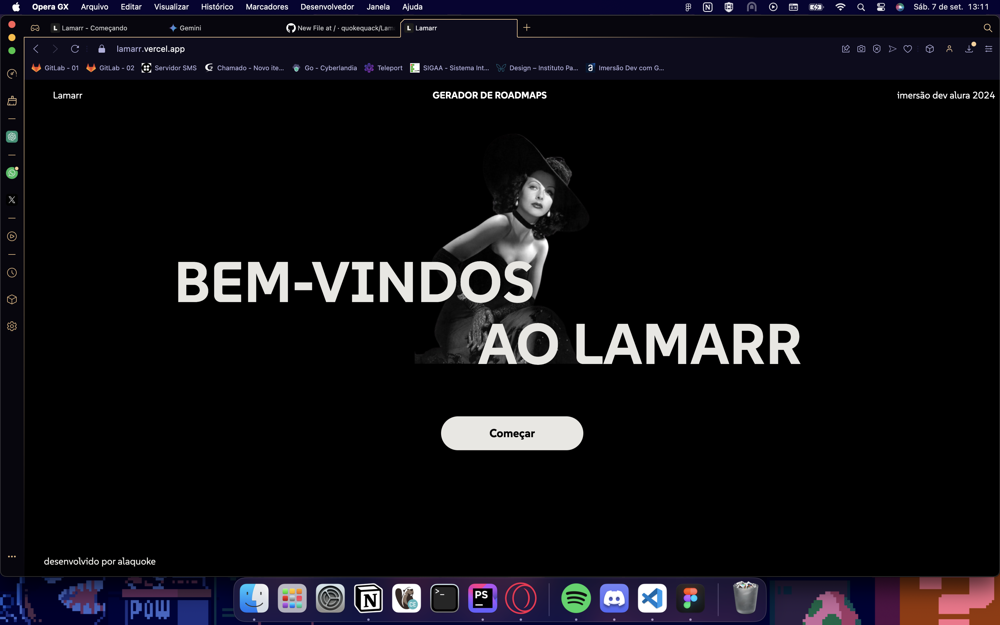

  

<h1> Lamarr - Trilha de aprendizado em menos de 5 minutos </h1>
<h2> Pensado para aqueles que não têm tempo ou possuem algum tipo de dificuldade de planejar uma rotina de estudos,
  o Lamarr cria uma trilha de estudos e uma rotina para tornar a busca por conhecimento mais simples e acessível. A partir de dois formulários simples,
  em menos de cinco minutos você possuirá uma trilha de estudos associada a uma rotina para que você só se preocupe em estudar.
</h2>

  

 O Lamarr foi feito para a Imersão Dev Alura + Google Gemini em 2024 e está disponível em <a href="https://lamarr.vercel.app">Lamarr</a>

<h2> Tecnologias</h2>

 Produzido com HTML, CSS e Javacript vanilla (não por opção)

 Ele também utiliza <a href="https://ai.google.dev"> a API do Google Gemini</a> para gerar os roadmaps e a biblioteca <a href="https://ai.google.dev">Marked.js</a> 

 O Lamarr foi feito com muito sofrimento em um dia e meio de programação, por favor, respeitem os direitos autorais!<3

